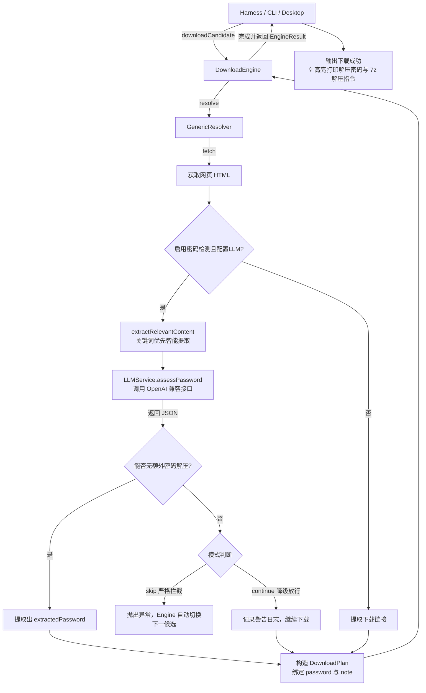

# LLM 解压密码智能检测与提取设计方案

## 1. 背景与目标

在 Galgame 资源检索与下载生态中，压缩包资源的可用性存在以下典型痛点：
1. **无密码 / 免安装**：资源纯净，可直接解压或直接运行。
2. **公开固定密码**：压缩包有密码，但页面正文、标题或站点说明中已直接公布有效明文密码（如“解压密码：xxx”）。
3. **障碍性密码（不可直接解压）**：
   - **引流套路**：需“关注公众号”、“加 QQ 群看公告”等操作；
   - **付费门槛**：需“赞助/VIP/购买”方可获取密码；
   - **多层套娃**：外层无密码但内层为未知密码包；
   - **失效/残卷**：分卷缺失或命名不全导致必然解压失败。

**核心目标**：
在下载前利用大语言模型（LLM）对通用网页内容进行智能分析：
- 识别资源是否属于“无门槛即可成功解压缩”的资源；
- 针对障碍密码资源提供严格跳过（`skip`）或警告继续（`continue`）机制；
- 针对公开密码资源，**自动提取明文密码**，并沿下载方案传递给后续展示与解压使用。

---

## 2. 总体架构与数据流链路



---

## 3. 核心接口与数据契约 (`downloader/src/types/index.ts`)

### 3.1 评估结果与解析上下文

```typescript
/** LLM 密码检测判定结果 */
export interface ArchivePasswordAssessment {
  /** 是否能直接/无额外阻碍地成功解压（无密码，或已有公开有效密码） */
  canExtractWithoutExtraPassword: boolean;
  /** 是否设置了密码 */
  hasPassword: boolean;
  /** 提取到的公开解压密码（如果有） */
  extractedPassword?: string;
  /** 风险类型 */
  riskType: 'none' | 'need_contact' | 'need_payment' | 'incomplete' | 'unknown';
  /** 简短说明（30字以内，便于日志记录与界面展示） */
  reason: string;
}

/** 扩展下载方案：将解压密码与下载方案直接绑定 */
export interface DownloadPlan {
  files: ResolvedDownload[];
  password?: string;  // 页面中提取到的解压密码
  note?: string;      // 说明信息（如展示给用户的提示）
}

/** 扩展下载引擎结果：向外传递密码 */
export interface EngineResult {
  success: boolean;
  paths: string[];
  manualHints: string[];
  password?: string;  // 成功提取的解压密码
  error?: string;
}

/** 扩展解析上下文 */
export interface ResolutionContext {
  signal?: AbortSignal;
  llmService?: LLMService;
  enablePasswordCheck?: boolean;
  passwordCheckFailureMode?: 'continue' | 'skip'; // 默认 'continue'
  onPasswordAssessment?: (assessment: ArchivePasswordAssessment) => void;
}
```

---

## 4. 关键算法与组件设计

### 4.1 智能 HTML 关键词优先提取 (`extractRelevantContent`)
避免全量 HTML 导致 Token 消耗膨胀或尾部密码被截断：
1. **清洗干扰标签**：移除 `<script>`、`<style>`、`<svg>`、`<iframe>` 等。
2. **优先级 1（核心命中）**：正则截取包含“密码”、“解压码”、“解压”、“提取码”、“访问码”、“password”等关键词前后各 200 字符的段落。
3. **优先级 2（正文主体）**：提取 `<main>`、`<article>`、`class="*content*"` 等容器内的文本。
4. **优先级 3（兜底全文本）**：提取页面粗文本并限制最大字符数（默认 12,000 字符）。

### 4.2 LLM 服务抽象 (`LLMService.ts`)
- **API 兼容性**：标准 OpenAI `v1/chat/completions` 接口（适配 DeepSeek、OpenAI、Ollama、LocalAI 等）。
- **严格 Prompt 约束**：要求大模型仅输出合法 JSON 字符串，不添加多余解释。
- **输出解析鲁棒性**：自动剥离 Markdown 代码块包裹（` ```json ... ``` `），防止 JSON.parse 异常。

### 4.3 密码传递与容错机制
1. **插入点**：位于 `GenericResolver.ts` 获取到 HTML 正文后、提取下载链接前。
2. **适用范围**：仅对通用网页（GenericResolver）生效；直链（非 HTML）与 API 接口型站点（如 Alist/Shinnku）自然跳过。
3. **容错与降级**：
   - 当 LLM 接口超时、网络异常或返回解析失败时，默认按 `continue` 模式降级放行，打印警告并继续执行正常下载，确保主流程可用性；
   - 用户可通过配置切换至 `skip` 严格模式。
4. **终端提示集成**：下载成功后，CLI 会高亮显示解压密码，并输出快捷解压命令示例：
   ```bash
   🔑 检测到解压密码: south-plus
   💡 解压提示：如果文件加密，请使用以下命令解压：
      7z x "game.rar" -p"south-plus"
   ```

---

## 5. 配置管理规范

配置文件支持以下优先级载入（高优先级覆盖低优先级）：
1. **环境变量**（首选，避免 API Key 意外入库）：
   - `SEARCHGAL_LLM_ENABLED` (`true` | `false`)
   - `SEARCHGAL_LLM_API_KEY`
   - `SEARCHGAL_LLM_BASE_URL` (默认 `https://api.deepseek.com/v1`)
   - `SEARCHGAL_LLM_MODEL` (默认 `deepseek-chat`)
   - `SEARCHGAL_PASSWORD_CHECK_MODE` (`continue` | `skip`)
2. **用户主目录配置**：`~/.searchgal/config.json`
3. **项目本地私有配置**：`downloader/.config.json`（已被 `.gitignore` 忽略）

---

## 6. 测试与验证方案

在 `downloader/tests/` 下建立测试套件：
1. **夹具数据 (`fixtures/password-samples.ts`)**：
   - 场景 A：无密码资源（免密）
   - 场景 B：明文公开密码资源
   - 场景 C：引流/加群/公众号障碍密码
   - 场景 D：付费/VIP 障碍密码
   - 场景 E：LLM 超时降级（Mock 异常）
2. **单元测试**：
   - `LLMService.test.ts`：测试清洗截断逻辑与大模型输出解析；
   - `GenericResolver.test.ts`：测试解析流程中的密码检查拦截与放行。
